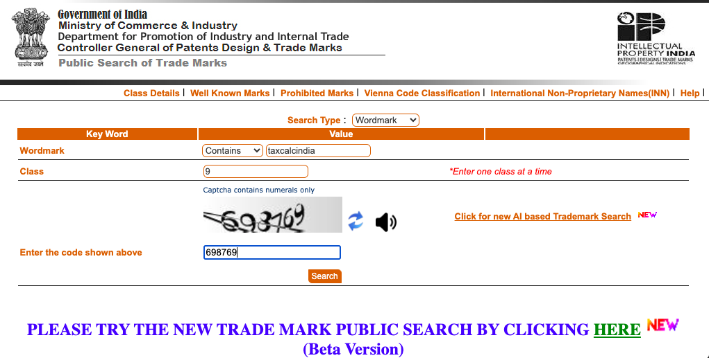
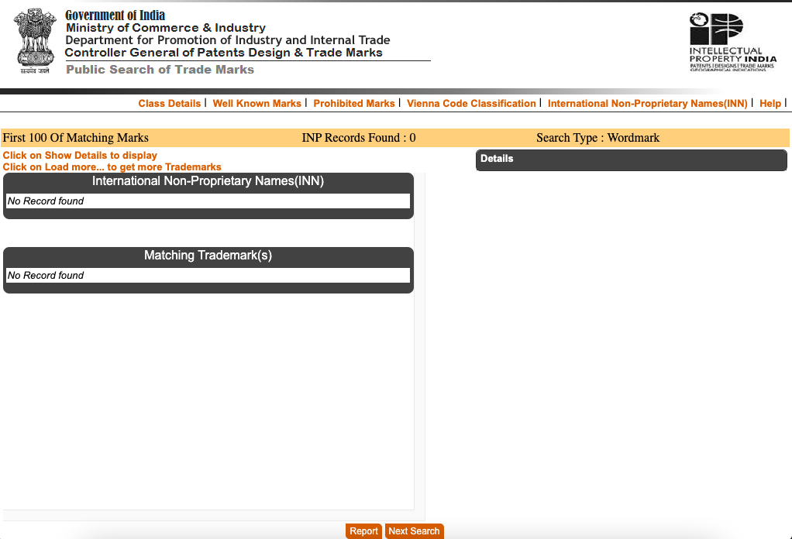

# Package name: `taxcalcindia`

Date checked: 14 January 2026

A trademark search for the package name "taxcalcindia" was performed on the Government of India Registered Trademark public search:
https://tmrsearch.ipindia.gov.in/tmrpublicsearch/frmmain.aspx

At the time of this package release (date above) there are no registrations for the name "taxcalcindia" on the Government of India trademark database. Screenshots of the search and search-result pages are included below for reference.

Search page:

Search results:

By publishing this repository with the name "taxcalcindia", the repository owner states that, to the best of their knowledge at the time of release, no Registered Trademark exists for that name in the Government of India database. The repository owner is not liable for any trademark allegations arising in the future.

This document is for informational purposes only and does not constitute legal advice. If you need legal certainty, consult a qualified attorney.